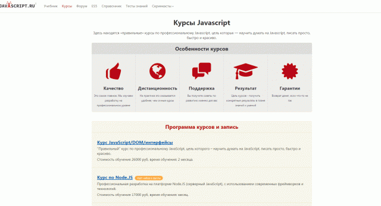

# Как попасть на front
## Как 1С-разработчику переквалифицироваться во фронтендера
Жизнь постоянно вносит коррективы, рано или поздно перед разработчиком возникает дилемма: продолжать совершенствоваться в текущем стеке или попробовать освоить новое. Причин возникновения таких мыслей – множество. Одни устают от однотипных задач, другие достигают потолка заработной платы, третьих загрызает рутина

Как попасть на front. Как 1С-разработчику переквалифицироваться во фронтендераСегодня мне хочется поговорить на такую необычную тему, как переквалификация разработчика. Да, мы знаем примеры, когда один разработчик владеет несколькими смежными технологиями, но мир технологий 1С не похож на другие. Компания «1С» стремительно расширяет собственную экосистему технологий, тем самым все сильнее «ограничивая» прикладных 1С-разработчиков в выборе – платформа покрывает разные ниши задач.

Получается, что типичный 1С-разработчик крутится в стеке, ограниченный одной платформой. Исключения составляют 1С-разработчики, пришедшие из других технологических стеков. Они прекрасно разбираются в альтернативных технологиях и инструмент для решения очередной задачи подбирают комплексно: если 1С может, но надежнее и проще сделать на другой технологии, выбирают второе.

Перейти в 1С-разработчики, имея за плечами опыт работы с популярными технологиями, несложно. Труднее вырваться из мира экосистемы 1С. Если опыта программирования, заисключением платформы «1С:Предприятие», нет, то перебежать в мейнстримовое для сегодняшнего дня направление – фронтенд – проблематично.

Мне приходится работать в двух мирах: фронтенд и 1С. Коллеги по 1С периодически задают вопросы, связанные с переквалификацией: как удается совмещать работу в двух противоположных лагерях и возможно ли переквалифицироваться закоренелому 1С-нику в фронтендеры? На мой взгляд, да, возможно.

## Немного истории

Свой путь программиста я начинал с популярного в нулевых языка программирования Delphi. Низкий порог входа, большое количество литературы на русском языке во многом определяли выбор. Везде были люди (речь о форумах), готовые безвозмездно проконсультировать и поделиться кодом. Многие мои ровесники пришли в программирование именно этим путем.

После Delphi были PHP и первые эксперименты с разработкой для веб. Тогда разработка веб-приложения целиком ложилась на плечи одного человека. Никакого разделения на front и back попросту не существовало.

Типичный веб-разработчик того времени был своеобразным комбайном:

* базовые навыки администрирования (хостинг);
* умение верстать (HTML/CSS);
* программирование на клиенте/сервере (PHP/JavaScript).

Вот здесь и начинаются основные различия между разработчиками, сразу начавшими путь с технологий от 1С, и теми, кто пришел из других стеков. Последние изначально привыкли применять несколько разных технологий, налаживать между ними связь и писать код на нескольких языках программирования.

В экосистеме 1С комфорт заложен изначально. Хорошо документирован перечень возможностей платформы. Собирать и переводить документацию не требуется – есть единое место технической литературы, созданное по упрощенному подобию MSDN. Из коробки доступны все необходимые инструменты для работы, и желание смотреть на другие технологии постепенно отпадает. В безумном мире фронтенда все по-другому (см. рис. 1).

## Проблема
С какой проблемой и сложностями в первую очередь столкнется типичный 1С-разработчик, решивший переквалифицироваться? Чрезмерно богатый стек технологий. Какие технологии в повседневной работе использует 1С-разработчик? Стандартную среду разработки (конфигуратор), встроенный язык и язык запросов, напоминающий ANSI SQL.

Фронтенд изначально стоит на трех громадных китах – HTML, CSS и JavaScript. Звучит не очень страшно, но перечисленные технологии в разы объемнее и глубже, чем все то, с чем приходится сталкиваться 1С-разработчику.

Хорошо, но разве в 1С не так? Есть вспомогательные технологии, требующие дополнительного времени на изучение (СКД, КД и т.д.). Какие здесь могут быть различия? Объем информации?

Веб-технологии развиваются не первый год, и объем знаний в этой области зашкаливает. За примерами далеко ходить не надо. Даже такая стандартная задача, как создание сетки страницы, имеет несколько способов решения, и как минимум три из них актуальны на сегодняшний день.

«*Так зачем мне их все знать, нельзя ли обойтись только самыми новыми?*» – возразят счастливчики ванильного мира 1С. И да, и нет. Для собственных проектов вы можете выбирать новые технологии (см. рис. 2) и подходы, но в промышленной разработке все сложнее.

Важность приобретает не применение всего нового и суперсовременного, а стабильность и максимальная поддержка со стороны браузеров. Какое дело бизнесу до Grid Layout, если большинство клиентов сидят на Internet Explorer 9?

Нужно с самого начала быть готовым изучать технологии и подходы, которые вот-вот умрут, но еще широко используются из-за «тормознутости» перехода пользовательских масс насовременные браузеры. Да, здесь априори быть не может лампового круга пользователей, которым вы всегда можете установить необходимые компоненты или обновления на ОС.

А если хочется просто программировать, может, тогда HTML/CSS не обязательно изучать? Нет, обязательно. Если хочется начать программировать на модном ныне JavaScript, тодалеко от верстки уйти не удастся. Верстка, разметка – неотъемлемая часть веб-приложения, и ее придется в том или ином виде делать. Необязательно становится верстальщиком 80-го уровня, но понимать базовые принципы интерпретации страницы, технологии обязательно.

Вторая краеугольная проблема кроется в английском языке. Нет, речь не об англоязычном синтаксисе языковых конструкций, а о самом языке. Хотя мой приятель, перешедший из 1С в .NET, акцентировал особое внимание именно на этой проблеме. Вроде как после долгих лет написания кода на кириллице (см. рис. 3) катастрофически сложно начать писать наанглийском.

Далеко не все 1С-разработчики владеют английским языком на уровне, позволяющем читать документацию. Компания «1С», на мой взгляд, допустила стратегическую ошибку. Вся документация по платформе изначально представлена на русском языке.

С одной стороны, упрощается чтение – русский априори известен. С другой – перед разработчиком появляется стена, закрывающая доступ к международной базе знаний. Мотивация изучать английский пропадает.

При отсутствии языковой практики осваивать технологии фронтенда будет тяжелее. Переводы книг заметно отстают, статьи по новым технологиям появляются сначала наанглийском, и, самое главное, вы лишаетесь возможности общаться с зарубежными коллегами. Поэтому надо собрать волю в кулак и, помимо ключевых технологий фронтенда, запланировать изучение английского языка. По мере роста вашей технической подготовки этот навык принесет свои плоды.

Чрезмерная динамика – еще один серьезный камень в профессии фронтенд-разработчика. Платформа 1С за годы устоялась и обросла вспомогательными технологиями. Новые технологии в мире 1С появляются не так часто, как это происходит в мире фронтенда.

1С-разработчик работает с привычным окружением, которое появилось с момента выхода первой версии платформы 8.0, различие кроется лишь в новинках. Подход к разработке вцелом остался прежним. Все тот же конфигуратор в качестве среды разработки, синтаксис языковых конструкций – все как было, за исключением плавных улучшений.

Да, отдельные инструменты устарели (вроде построителя отчетов), но в целом развитие происходит вертикально – появляется новый функционал, который впоследствии совершенствуется и развивается.

В мире фронтенда все меняется быстро. Движение идет по всем направлениям: совершенствуется CSS, обновляется JavaScript, регулярно появляются вспомогательные инструменты, фреймворки. Затем одни инструменты заменяют другие и т.д. Все это напоминает нескончаемую гонку.

Решив стать фронтенд-разработчиком, вы превращаетесь в пилота болида формулы поглощения новой информации и бесконечных тестов. Чтобы оставаться на коне, придется непрерывно учиться, экспериментировать с новыми подходами и тестировать бесконечное множество вспомогательных инструментов.

Обилие инструментов, библиотек и фреймворков на первых этапах будет повергать в шок, но отчаиваться не стоит. Главное – понимать, что основа всего – фундаментальные знания (HTML/CSS/JavaScript), а дополнительные компоненты – лишь инструменты, созданные для решения определенного круга задач.

Если вы дочитали до этого места и желание познать захватывающий мир фронтенда не пропало, поздравляю, у вас все может получиться!

## Определяем цели

Наша главная цель – войти в мир фронтенда и достичь уровня джуниор. Понимаю, что всего хочется добиться быстро, но такое бывает только в кино.

Начнем с предметов изучения. На первых порах ими должны стать HTML и CSS. Напомню, нас интересуют сами технологии, без дополнительных примочек в виде Bootstrap или Foundation. Аналогично с JavaScript – наша задача понять основные концепции языка и научиться его применять для решения реальных задач. Фреймворки, вспомогательные библиотеки оставляем на потом.

## Самообразование
Большую часть своего опыта программирования я приобрел за счет самообразования. Книги, общение с коллегами, участие в проектах с более опытными разработчиками – этолучшие мои учителя. До сих пор остаюсь верным этой традиции и первым делом начинаю разбираться с новой технологией самостоятельно.

К счастью, фронтенд – популярная тема, поэтому материалов много. Главное – успевать их фильтровать и выбрасывать устаревшие. В сети можно найти абсолютно все, но начать ябы рекомендовал с книг.

На сегодняшний день рекомендую обратить внимание на несколько книг: Дэвид Сойер Макфарланд «Новая большая книга CSS», Леа Веру «Секреты CSS», Эрик А. Мейер «Секреты CSS», Дэвид Флэнаган «JavaScript», Джон Резиг «Секреты JavaScript-ниндзя», серия «Head First».

Приведенный перечень книг еще не успел устареть, и их хватит для того, чтобы начать писать реальный код. Книги приведены в порядке, соответствующем уровню подготовки. Начинаем изучать азы с «Новой большой книги CSS» и дальше по списку. Исключение – серия «Head First».

Если вам нравится шуточный стиль повествования и вы быстро хотите освоить минимальную базу, то присмотритесь к книгам серии «Head First» (см. рис. 4) от издательства O’Relly. Не пугайтесь объема. Книги содержат множество рисунков и больше напоминают комиксы, одну книгу вполне реально осилить за одну-две недели неспешного чтения.

Важно помнить – любые книги по современным технологиям устаревают. Как только вы разберетесь с рекомендуемым перечнем литературы и начнете писать код, возьмите впривычку заглядывать в официальные источники информации – спецификации или сайты вроде MDN (https://developer.mozilla.org/ru/docs/Web). Спецификация – последняя инстанция. Проведите параллель с ИТС – источник определяет, как должна работать технология по задумке авторов.

Изучая сложные технологии, переписывая код примеров авторов книг, задавайте вопрос: как работает конструкция «x»? К этому же вопросу стоит прибегать во время тестирования готовых решений с форумов. Веб-технологии быстро развиваются, а код имеет свойство копироваться. Не исключено, что сегодня ваша проблема решается проще.

## Online-школы

Интернет стирает любые границы, и сегодня вы без труда можете изучить любые технологии, не выходя из дома. Рынок онлайн-образования шагнул далеко вперед, и отдельные школы предлагают освоить сложный материал в максимально интерактивном режиме.

Количество школ, специализирующихся на обучении веб-технологиям, растет год от года. Одни применяют инновационные методики, приближающие студента практически креальным условиям разработки в команде, другие, напротив, преподносят материал в классическом виде – лекции, домашки.

Мне в свое время довелось поучиться в трех школах, а теперь в одной из них я работаю на постоянной основе в качестве наставника. Сразу оговорюсь: все ниже перечисленные образовательные проекты предоставляют качественный контент. Отличается лишь формат подачи материалы.

Online-школы ускоряют процесс обучения и помогают обойти подводные камни, подстерегающие неопытного новичка. Получить схожий объем знаний при должной мотивации ипрактике реально самостоятельно, но на это потребуется значительно больше времени. Во время изучения новой для себя технологии вы обязательно столкнетесь с типичными проблемами и вопросами. Некоторые из них легко гуглятся, а на другие приведено такое огромное количество ответов, что непонятно, где кроется истина.

Профессионально подготовленные обучающие программы признаны решать подобные проблемы. Опытный преподаватель (обычно это человек с большим практическим опытом) делится своими знаниями и сразу рассказывает о наиболее часто возникающих проблемах. Таким образом, студент сразу узнает о существовании проблемы и оптимальных методах ее решения.

Второй жирный плюс современных online-школ – наличие наставников (менторов). На этапе обучения за студентом закрепляется наставник, который призван помогать проходить обучение. Наставник проверяет выполненные задания, дает советы по организации кода, комментирует решения и делится своими знаниями. Студент может общаться с наставником как голосом (Skype), так и переписываться.

Мне хорошо известно, что пока подобных курсов (с персональными менторами) по технологиям 1С попросту нет, и, на мой взгляд, это большое упущение. Лектор не в состоянии ответить на все вопросы студентов и оказать должную поддержку. Из-за это часто бывает, что вроде бы теория есть, а в практике – пробелы.

Другой немаловажный плюс online-школ – практика. Студентам предлагают решение не просто абстрактных задач, а реализацию проекта. За вас придумывают идею (в некоторых случаях даже несколько), формируют техническое задание, определяют критерии выполнения и разбивают весь процесс на мелкие задачи. Вам остается только писать код всоответствии с четко прописанными требованиями.

Как я уже сказал, online-школ много, но для изучения фронтенда мне особенно хочется выделить три: [HTML Academy](http://htmlacademy.ru), [Hexlet](http://hexlet.io) и [Learn JavaScript] (http://learn.javascript.ru) (см. рис. 5-7). В каждой школе оригинальный процесс обучения, поэтому ориентироваться стоит на свои предпочтения. За качество преподавания беспокоиться не стоит – во всех перечисленных школах работают профессионалы.

## Первый практический опыт
Читать и изучать технологию на вымышленных примерах долго нельзя. Разобравшись с основами, сразу стоит переходить к практике. 1С-разработчики, прошедшие официальные курсы обучения, наверняка помнят абсурдность и неприменимость задач относительно реального мира.

Без практики освоить фронтенд не получится (как и любые другие технологии). Чем больше вы напишете кода и решите реальных задач, тем быстрее концепции этого стека улягутся в голове. В связи с этим вам надо сразу придумать какой-то демо-проект. Своим студентам я всегда рекомендую начинать с создания блога.

Блог – банальное веб-приложение, но на примере его создания можно отточить многие из навыков. Да, тут еще затрагивается серверная часть, но всегда можно прийти ккомпромиссному варианту и сфокусироваться на верстке, решении проблем адаптивности и оживлении отдельных элементов с помощью JavaScript.

Работая над собственным проектом, вы проходите весь стандартный цикл разработки: от идеи до релиза. Прекрасным подспорьем станут создание реального блога и егопоследовательное улучшение. Даже такой простой проект, как блог, можно улучшать бесконечно.

Хорошо, но ведь для тренировки потребуется дизайн? Где его взять? В наше время найти свободный дизайн – не проблема. Несколько запросов в Google выведут вас на базы бесплатных PSD-файлов, идеально подходящих для тренировок.

Во время написания тренировочного кода не забывайте поглядывать на код аналогичных проектов. На популярном хостинге GitHub таких проектов вагон и маленькая тележка. Обратите внимание: стоит именно поглядывать, а не копировать. Бездумное копирование еще никому не приносило пользы.

Читать код других разработчиков в процессе обучения чрезвычайно полезно. Эту практику я освоил еще со времени программирования на Delphi. Да, не весь код одинаково полезен, но прелесть GitHub – наличие рейтингов. Если проект полезен и интересен, то звезд у него будет немало.

Чтение и изучение чужого кода поможет вам расширить кругозор и посмотреть, как задачу можно решить не в стиле 1С. Мне приходилось работать с PHP-разработчиками, пришедшими из стека 1С. Их ранний код сразу выделяется на фоне других – задачи решены так, как если бы их решали в 1С. В некоторых случаях это допустимо, но чаще всего решения избыточны и проще решаются, если следовать изначальным принципам языка программирования.

Особенно это касается языка программирования JavaScript. Он сильно отличается от других известных средств разработки, а со встроенным языком 1С провести параллель еще сложнее. Даже не пытайтесь переложить опыт программирования на 1С в JavaScript. Этой попыткой вы только усложните процесс обучения.

## Инструменты
Если вы смогли осилить разработку собственного проекта – как минимум у вас появился собственно-разработанный блог, вы готовы переходить к изучению дополнительных инструментов. Начинающих фронтендеров всегда пугает количество доступных для применения инструментов. Может даже показаться, что новые инструменты появляются чересчур интенсивно, а делают их ради самих инструментов.

Инструментов действительно много, но не стоит пытаться изучить их все сразу. Хорошего из этого ничего не выйдет. Запомните: инструменты созданы, чтобы решать определенные задачи или автоматизировать рутинные операции. Понять, что именно подлежит автоматизации, вы сможете после завершения разработки своего первого проекта.

Попробуйте на этом шаге посмотреть в сторону фреймворков. В отличие от платформы «1С:Предприятие», где главенствует по факту один-единственный фреймворк (Библиотека стандартных подсистем), в мире фронтенда их предостаточно. Например, для CSS есть хороший фреймворк Bootstrap/Foundation. Попробуйте с их помощью решить вашу задачу. Она упростится или усложнится? Если решение получилось оптимальным, то за счет чего этого удалось добиться авторам фреймворка?

Изучение библиотек/фреймворков, при наличии хорошей базы по технологиям, позволит сделать серьезный скачок в прокачивании навыков. Авторы фреймворков тратят множество времени на поиск и консолидацию решений, чтобы облегчить процесс разработки другим разработчикам. Не следует сторониться этого опыта, изучайте различные решения ивыбирайте наиболее удобный для себя вариант.

Рассмотрение фреймворков выходит за рамки статьи, но я предвижу ваш вопрос: какой фреймворк самый лучший? В мире 1С легко назвать оптимальную технологию – их список ограничен. Во фронтенде другие правила. Решений множество, и каждое выделяется уникальными возможностями. Выбрать лучший для себя вариант возможно только эмпирическим путем. Единственное, чем могу здесь помочь, – сузить круг поисков. Начните эксперименты с наиболее популярных решений: **Angular, React.js, Ember.js, Vue.js**.

Изучая фреймворки, вы обязательно столкнетесь с необходимостью изучения вспомогательных инструментов: npm, Node.js, GulpJS, Webpack, PostCSS и т.д. Это отдельная история, и к ним вы обязательно придете. Какое-то время вы сможете обходиться без них, но когда освоите, работа упростится.

Уместить в одну статью все советы и варианты переквалификации 1С-разработчика в фронтендера невероятно сложно. Предложенный мной путь достижения цели может показаться слишком долгим и сложным, но все зависит от вас. Все мы по-разному усваиваем информацию и обладаем разным уровнем мотивации. Быть может, ваш путь станет значительно короче.

В любом случае, если вы поставили серьезную цель и не боитесь трудностей, все будет в порядке. Опыт работы со студентами показывает, что стать программистом (а не просто переквалифицироваться) реально, в любом возрасте и даже без начальных навыков. Двое моих студентов успешно переквалифицировались в разработчиков в возрасте 40+ и с 15-летним экономическим стажем.

Возможно все, вопрос только во времени.