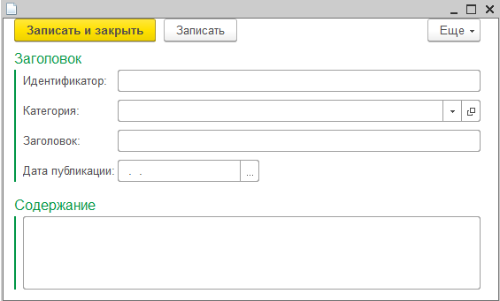

# Нестандартный back-end для веб-приложений
## Практическое применение HTTP-сервисов в "1С:Предприятие 8"

Слово “backend” у современных разработчиков невольно ассоциируется с мейнстримовыми технологиями вроде Java, ASP .NET, PHP, Node.js и т.д. Популярный стек технологий для веб-приложений прочно укрепился в умах разработчиков и кажется, новичкам на этом поприще нет места. Отнюдь! Новые инструменты приходят с неожиданных сторон и занимают уверенные позиции в новых нишах.

Взять, к примеру, известную всем платформу “1С:Предприятие 8” - современная среда разработки бизнес-приложений различного масштабы. Платформа развивается не первый год, и за это время с ее помощью было создано большое количество конфигураций, успешно решающих различные задачи бизнеса.

Платформа относительно недорога в лицензировании, обладает богатым инструментарием для разработки, и хорошо подходит как для небольших проектов, так и для огромных, ориентированных на автоматизацию крупнейших корпораций. Если раньше “1С:Предприятие” больше ассоциировалось со словом “Бухгалтерия”, то сегодня это в первую очередь платформа - конструктор для разработки самых разнообразных приложений, нацеленных на работу в гибридной среде.

Под гибридной средой подразумевается стек поддерживаемых операционных систем, способных выполнять решения, разработанные при помощи платформы “1С:Предприятие”. Если раньше вариант был по факту один - Windows (шаманства с Wine считать не будем), то сегодня список систем назначения существенно расширился. За годы развития платформа научилась работать в Web, Linux, macOS, Android и iOS.

На страницах журнала мы поднимали вопрос разработки мобильных приложений с помощью платформы “1С:Предприятие” (ссылка на журнал), а также разбирали смежные технологии. В рамках этого материала мы рассмотрим вопросы применения платформы в роли серверной части (back-end) для создания веб-приложений.

Это может звучать странно, особенно для разработчиков, привыкших к типичному набору технологий для решения подобных задач, однако, практика показывает, что не всегда требуется падать в омут популярных технологий, чтобы разработать корпоративное веб-приложение, ориентированное на строго определенную категорию пользователей.

## 1С:Предприятие на сервере

Что представляет серверная платформа для разработки веб-приложений? Как правило, это - язык программирования, веб-сервер и СУБД. Веб-сервер принимает пользовательские запросы, перенаправляет их на соответствующее приложение, которое в свою очередь знает, как их обработать. Одним из популярных решений подобного класса задач давно является - LAMP (Linux, Apache, MySQL и PHP).

А что мешает нам, использовать вместо MySQL и PHP возможности платформы 1С? Она прекрасно дружит с веб-сервером Apache - проверенный годами веб-клиент лишнее тому подтверждение. О системе хранения данных говорить и вовсе не приходится - платформа изначально была ориентирована для решения задач хранения и обработки данных. С языком программирования тоже вполне все ясно - он развивается и пригоден для решения самых разнообразных задач.

Пожалуй, вопрос упирается лишь в обработку клиентских http-запросов. Платформа должна уметь принимать клиентские запросы, разбирать их и возвращать ответы. Актуальные версии платформы “1С:Предприятие 8” позволяют элегантно решать подобные задачи с помощью объекта метаданных типа “HTTP-сервисы”.

## Все “за” и все “против”

Рассматривая платформу “1С:Предприятие” в качестве серверной части веб-приложения, возникает резонный вопрос: “Зачем?”. Для чего заморачиваться с еще одним инструментом, если их и так уже много?

Замечание уместное, но ответ всегда зависит от контекста применения. Да, платформа “1С:Предприятие” научилась решать изначально несвойственные для нее задачи, но никто не говорит, что пора забросить в чулан другие решения и уж тем более переписывать существующую кодовую базу. К новому инструменту стоит приглядеться при решении новых, специфичных задач. Расскажу немного о своем опыте.

В нашей компании небольшая команда разработчиков и все специализируются на разработке под платформу “1С:Предприятие 8”. Ребята знают стек технологий от 1С, прекрасно ориентируется в MS SQL сервере, но не имеют весомого багажа знаний по веб-технологиям.

За годы работы создано несколько корпоративных решений как для совместного применения с партнерами (географически распределенные приложения), так и для внутренних нужд компании. В свое время мы отдали предпочтение платформе от 1С за ее распространенность, доступность и гибкость.

Мода на веб-сервисы и предоставление услуг в электронном виде продолжает набирать обороты и компании, специализирующиеся целиком на оффлайн услугах, хотят плавно войти в веб. Учитывая специфичность предоставляемых услуг и отсутствие общего понимания трансформации бизнеса в Интернет, компании бывают не готовы сразу инвестировать в разработку полноценного веб-приложения. Это рискованное и чересчур затратное мероприятие.

Совсем другое дело, когда команда может создать прототип будущего приложения, протестировать его на реальных пользователях и после этого принять решение о целесообразности разработки на актуальных для веба технологий.

Не стоит думать, что функционал платформы (в контексте веб-приложения) ограничиваются лишь быстрым прототипированием серверной части. Вовсе нет, созданные прототипы вполне могут превратиться в полноценные приложения и успешно решать поставленные задачи 24/7. К тому же, это не единственный вариант применение механизма HTTP-сервисов платформы.

## Все “за” и все “против”

Рассматривая платформу “1С:Предприятие” в качестве серверной части веб-приложения, возникает резонный вопрос: “Зачем?”. Для чего заморачиваться с еще одним инструментом, если их и так уже много?

Замечание уместное, но ответ всегда зависит от контекста применения. Да, платформа “1С:Предприятие” научилась решать изначально несвойственные для нее задачи, но никто не говорит, что пора забросить в чулан другие решения и уж тем более переписывать существующую кодовую базу. К новому инструменту стоит приглядеться при решении новых, специфичных задач. Расскажу немного о своем опыте.

В нашей компании небольшая команда разработчиков и все специализируются на разработке под платформу “1С:Предприятие 8”. Ребята знают стек технологий от 1С, прекрасно ориентируется в MS SQL сервере, но не имеют весомого багажа знаний по веб-технологиям.

За годы работы создано несколько корпоративных решений как для совместного применения с партнерами (географически распределенные приложения), так и для внутренних нужд компании. В свое время мы отдали предпочтение платформе от 1С за ее распространенность, доступность и гибкость.

Мода на веб-сервисы и предоставление услуг в электронном виде продолжает набирать обороты и компании, специализирующиеся целиком на оффлайн услугах, хотят плавно войти в веб. Учитывая специфичность предоставляемых услуг и отсутствие общего понимания трансформации бизнеса в Интернет, компании бывают не готовы сразу инвестировать в разработку полноценного веб-приложения. Это рискованное и чересчур затратное мероприятие.

Совсем другое дело, когда команда может создать прототип будущего приложения, протестировать его на реальных пользователях и после этого принять решение о целесообразности разработки на актуальных для веба технологий.

Не стоит думать, что функционал платформы (в контексте веб-приложения) ограничиваются лишь быстрым прототипированием серверной части. Вовсе нет, созданные прототипы вполне могут превратиться в полноценные приложения и успешно решать поставленные задачи 24/7. К тому же, это не единственный вариант применение механизма HTTP-сервисов платформы.

## Отказ от стандартных клиентов

Типовой веб-клиент - далеко не самое быстрое и удобное решение. Стандартный фронт, генерируемый веб-клиентом 1С, сильно тяжел, как в плане ресурсов, так и трафика. Он подходит к использованию далеко не во всех случаях. HTTP-сервисы элегантно решают подобные проблемы - “1С:Предприятие” остается жить на сервере, а клиентская часть переезжает на актуальные для веба технологии (HTML/CSS/JavaScript).

В некоторых случаях, HTTP-сервисы могут стать единственной возможностью для предоставления доступа к информационным базам, работающих в режиме обычного приложения. Их нельзя опубликовать в вебе стандартными средствами, поэтому организация доступа через легкие самописные клиенты, может остаться единственной возможностью переноса ИБ в онлайн.

Нужны примеры? Хорошо, представим, что вам потребовалось вынести определенный функционал конфигурации в онлайн. Формирование специфичных отчетов, оперативный мониторинг показателей – все это легко решить посредством HTTP-сервисов. В нашей компании мы смогли таким образом предоставлять удаленным сотрудникам всевозможную отчетность без полного доступа к базе. Избавили коллег от необходимости устанавливать отдельные клиенты, а просто сверстали адаптивный сервис, напрямую обращающийся к корпоративной ИБ.

## Практическая сторона вопроса

Для демонстрации возможностей «HTTP-сервисов», создадим небольшое приложение – отдельную конфигурацию, умеющую принимать и отправлять HTTP-запросы/ответы. Внутренние механизмы платформы развиваются крайне быстро, поэтому рекомендую для демонстрации использовать актуальную версию «1С:Предприятие». На момент написание статьи таковой была – 8.3.9.2033. При необходимости обновляйте версию платформы и создавайте новую информационную базу данных.

В рамках статьи разработаем приложение для ведения корпоративной новостной ленты, позволяющее пользователем компании заходить на внутренний сайт и читать новую корпоративную информацию. Сделаем упор на серверной части и создадим многофункциональный HTTP-сервис. Он будет отвечать за формирование новостной ленты на сервере, и предоставлять дополнительное API (добавление новостей, передача ленты в JSON и т.д.). Полную версию приложения, а также вспомогательные файлы вы найдете в исходниках в статье.

## Конфигурация
Создадим новую конфигурацию и добавим в нее несколько объектов метаданных. Потребуются:

* Подсистема **“Новости”**. Активируем для нее отображение в командном интерфейсе. Подсистема необходима для служебных целей, в нее будут входить все остальные объекты метаданных.

* Справочник **“КатегорииНовостей”**. Дополнительных реквизитов у справочника делать не будем. Просто включим в единственную подсистему. Его роль будет ограничиваться определением новостных разделов (категорий).

* Регистр сведений **“НовостиКомпании”**. Регистр будет хранить всю новостную ленту. Для удобства ввода информации рекомендует уделить немного внимания дизайну формы записи (см. рисунок 1).



Для регистра **“НовостиКомпании”** потребуется определить два измерения:

* ИдентификаторНовости (Строка, 36 символов) - уникальный идентификатор отдельно взятой записи.
* НовостнойРаздел (СправочникССылка.КатегорииНовостей) - ссылка на элемент справочника “Категории новостей”;

Заголовок новости, содержание и дату публикации будем хранить в ресурсах:

* Заголовок (Строка, 150 символов);
* ДатаПубликации (Дата и время);
* Содержание (Строка, 800 символов). Установим флаг “Многострочный режим”;

Конфигурация в работе продемонстрирована на рисунке 2. Для удобства тестирования сразу добавим в регистр демонстрационные публикации (см. рисунок 3 - 4).


Вернемся в конфигуратор и добавим в соответствующий раздел дерева метаданных первый объект типа HTTP-сервис. Назовем его **“Новости”** (см. рисунок 5) и укажем “**Корневой URL**”. Поскольку сервис отвечает за отдачу новостной ленты, корневым URL’ом определим “**news**”.


В окне конфигурирования HTTP-сервиса (см. рисунок 5) перейдем на вкладку “**Шаблоны URL**” и добавим новый шаблон. Шаблоны URL позволяют определить пути действиям.

Первый шаблон назовем "**ПоследниеНовости**", в свойстве “**Шаблон**” (описываем адрес ресурса) укажем: “*/api/list/{count}*” (без кавычек). Таким образом, путь к получению последних n-новостей будет выглядеть так: **http://<АдресСервера>/sysadm/hs/news/api/list/10**. Разберем ссылку по сегментам.

1. **Адрес сервера**. В рамках примера применяется Apache, установленный на localhost.
2. **sysadm** - имя опубликованной информационной базы. Задается во время публикации веб-клиента/HTTP-сервисов в разделе “Администрирование” -> “Публикация на веб-сервере”.
3. **hs** - служебный атрибут, позволяющий системе определить, что обращение идет именно к HTTP-сервису.
4. **news** - Корневой URL HTTP-сервиса.
5. **api/list/10** – заданный шаблон URL.

Особое внимание следует обратить на последний сегмент URL - шаблон. Помните, при создании шаблона мы указали “**api/list/{count}**”? Фигурные скобки относятся к специальным символам формирования шаблона и подразумевают наличие непустых символов между ними. В нашем случае мы требуем от пользователя указания числа - количество выводимых новостей. При обработке пользовательского запроса, мы сможем получить значение этого параметра обратившись по идентификатору “**count**”.

Фигурные скобки - не единственные специальные символы для формирования шаблонов. Вы также можете использовать символ “*”. Он используется только в конце строки описания шаблона и подразумевает возможность указания любого количества сегментов url или их отсутствия. Например: шаблон “/api/*” будет соответствовать и “/api/main”, и “/api/superapi/”, и т.д.

Теперь добавим к созданному шаблону метод и реализуем в нем обработчик события для обработки запроса клиента. Именовать метод обработки запроса можно как угодно, но рекомендуется в качестве имен использовать название HTTP-методов. Например: **GET, POST, PATCH, DELETE** и т.д.

Итак, добавляем к шаблону “**ПоследниеНовости**” метод **GET**, в свойствах задаем HTTP-Метод (**GET**) и создаем обработчик события. Платформа автоматически сгенерирует заготовку функции с именем - “**ПоследниеНовостиGET**”. Вполне удобное название, позволяющее быстро сориентироваться в модуле с кучей однотипных функций. В тело функции переписываем код из листинга 1.

### Листинг 1. Реализация функции “ПоследниеНовостиGET”

```
КоличествоНовостей = Число(Запрос.ПараметрыURL["count"]);	
КонтекстРегистра = РегистрыСведений.НовостиКомпании; 
СписокНовостей =  КонтекстРегистра.ПолучитьПоследниеНовости(КоличествоНовостей);
СписокНовостейJSON = Хелперы.ПреобразоватьСтруктуруДанныхВJSON(СписокНовостей);
		
Ответ = Новый HTTPСервисОтвет(200);
Ответ.Заголовки.Вставить("Content-Type", "application/json");
Ответ.УстановитьТелоИзСтроки(СписокНовостейJSON, КодировкаТекста.UTF8, ИспользованиеByteOrderMark.НеИспользовать);
Возврат Ответ;
```

### Листинг 2. Реализации функции “ПреобразоватьСтруктуруДанныхВJSON”

```
Функция ПреобразоватьСтруктуруДанныхВJSON(СтруктураДанных) Экспорт	
	ЗаписьJSON = Новый ЗаписьJSON;
	ЗаписьJSON.УстановитьСтроку();	
	ЗаписатьJSON(ЗаписьJSON, СтруктураДанных);	
	РезультатКонвертацииВJSON = ЗаписьJSON.Закрыть();
	
	Возврат РезультатКонвертацииВJSON;	
КонецФункции
```

В начале первого листинга выполняется выборка новостей в соответствии с запросом клиента. Желаемого количество новостей определяется параметром count (мы указали его при создании шаблона). Все параметры передаются в виде строк, поэтому не забываем перед использованием привести к нужному типу.

Стоит обратить внимание, что параметры передаются “*как есть*”, т.е. никаких встроенных механизмов, проверки на опасное содержимое нет. В реальных проектах необходимо обязательно планировать фильтрацию входящих данных и принудительно отсекать опасное содержимое, способное привести к различным атакам (SQL Inj и т.д.).

Далее обращаемся к функции “*ПолучитьПоследниеНовости()*”, описанной в модуле менеджера регистра сведений “НовостиКомпании”. Функция запросом выбирает из регистра требуемое количество новостей и возвращает результат в виде массива структур. Я не стал приводить код этой функции, т.к. это типичная выборка данных в 1С, можете посмотреть его в исходниках к статье.

Хорошо, массив данных получен. Теперь требуется преобразовать его в JSON, вставить в объект типа “*HTTPСервисОтвет*” и вернуть клиенту. В платформе «1С:Предприятие» уже давно имеются встроенные методы для работы с JSON. Для большего удобства и создал в конфигурации общий модуль и в нем описал функцию-обертку “*ПреобразоватьСтруктуруДанныхВJSON*” (см. листинг 2). На вход она принимает структуру или массив структур и возвращает строку в JSON формате.

Выполнив преобразование в JSON, эстафетную палочку перенимает объект типа “*HTTPСервисОтвет*”. Во время инициализации объекта мы передаем код состояния HTTP. Спецификация протокола выделяет 5 групп кодов состояния - 1ххх (информационные), 2ххх (успешно), 3ххх (перенаправление), 4ххх (ошибки клиента), 5ххх (ошибки сервера).

Каждая группа включает несколько кодов состояний, и подробней с ними вы сможете ознакомиться в соответствующем RFC. Поскольку мы готовы отдать клиенту документ (JSON) за которым он обратился, передаем код 200 - запрос выполнен успешно.

Болванка HTTP-ответа готова, и остается указать тип контента, который будет передан клиенту. По этому параметру браузер клиента сможет определить и выбрать правильную стратегию обработки полученных данных. Для JSON-контента применяется “*application/json*”.

Последним действием перед отправкой ответа клиенту будет вызов метода «УстановитьТелоИзСтроки» у объекта ответа. В качестве параметра он принимает данные, которые требуется вставить в HTTP-ответ.


## Рендеринг на сервере
С получением и обработкой простых запросов мы разобрались. Теперь рассмотрим еще один полезный кейс - рендеринг на сервере. Представим, что нам требуется отдавать данные не просто в JSON, а в виде полноценно сверстанной веб-страницы.

Рассмотрим наиболее простое решение. Для начала необходимо подготовить заготовки html/css файлов - сделать верстку. Подробно рассматривать этот процесс не будем, т.к. тема выходит за рамки статьи.

Для ускорения процесса верстки я воспользовался CSS-фреймворком “skeleton” и без лишних изысков накидал структуру страницы будущей новостной ленты (см. рисунок 7). Все необходимые внешние ресурсы (CSS, JS) размещены в соответствующей директории веб-сервера.


Мы договорились, что будем формировать страницу на сервере, поэтому каким-то образом нам надо перенести разметку HTML-документа на сервер. Опять же, есть несколько способов: скопировать HTML-код страницы и поместить его в общем макете или брать напрямую из доступной директории. Выбор способа зависит от окружения. В примере будем ориентироваться на первый вариант - создадим общий макет типа “Текстовый документ” и назовем его “НовостнаяЛента”.

Поместим в этот макет разметку страницы и в области вывода новостной ленты вставим условную метку “{{news}}” (см. рисунок 8). При формировании html-документа мы будем искать метку и вместо нее вставлять сгенерированный html-код.


### Листинг 3. Разметка новостной публикации

```
<div class=""news-item"">
<h3 class=""news-item__title"">%1 / %2</h3>
<div class=""news-item__text"">%3</div>
<div class=""news-item__date"">%4</div>
             </div>
<hr>";
```

### Листинг 4. Функция ПримерРендерингаНаСервереGet

```
МакетСтраницы = ПолучитьОбщийМакет("НовостнаяЛента");
СодержимоеМакета = МакетСтраницы.ПолучитьТекст();
ДокументДляПодстановки = Новый ТекстовыйДокумент;
// Получение публикаций в СписокНовостейДляПубликации 
//ШаблонЭлемент = см. Листинг 3.
			
Для Каждого ЭлементНовости Из СписокНовостейДляПубликации Цикл
НоваяНовость = СтрШаблон(ШаблонЭлементаНовость, 
ЭлементНовости.НовостнойРаздел, 
ЭлементНовости.Заголовок, 
ЭлементНовости.Содержание, 
ЭлементНовости.ДатаПубликации
);
ДокументДляПодстановки.ДобавитьСтроку(НоваяНовость);
КонецЦикла;			
СодержимоеМакета = СтрЗаменить(СодержимоеМакета, "{{news}}", ДокументДляПодстановки.ПолучитьТекст());
	
Ответ = Новый HTTPСервисОтвет(200);
Ответ.Заголовки.Вставить("Content-Type","text/html; charset=utf-8");
Ответ.УстановитьТелоИзСтроки(СодержимоеМакета, КодировкаТекста.UTF8, ИспользованиеByteOrderMark.НеИспользовать);
	
Возврат Ответ;
```

Из-за объема кода мне пришлось оптимизировать 4-й листинг, поэтому при переписывании кода обращайте внимание на комментарии и исходный код примеров. В третьем листинге приведена разметка одной новостной публикации. Я ее поместил в строковую переменную и расставил метки (%1, %2 и т.д.) для дальнейшей подстановки значений с помощью встроенной функции “**СтрШаблон()**”.

Подготовив шаблон, можно приступать к получению данных из базы для вывода и начинать компоновку страницы. Поскольку объем новостных публикаций может быть немалым, все сформированные шаблоны одной публикации помещаются в отдельный текстовый документ. Как только текстовый документ с шаблонами будет полностью готов, нам необходимо заменить им метку “{{news}}”, определенную в макете (заменяем с помощью СтрЗаменить()).

Отправку полностью сформированного HTML-документа выполняем с помощью уже знакомого объекта типа “HTTPСервисОтвет”. Единственное отличие от прошлого примера в отправляемом заголовке. Для HTML документов указваем “text/html”. Посмотреть получившуюся страницу можно на рисунке 9.


## Рендеринг на клиенте
Рендеринг на севере удобен далеко не всегда. Рано или поздно возникнет необходимость собирать страницы прямо на клиенте. С точки зрения программирования решать подобные задачи проще и сложней одновременно.

Легче в плане написания кода на 1С - достаточно подготовить данные в JSON и отправить их клиенту. Сложность заключается в написании кода клиентской части. Тут одними знаниями HTML/CSS не обойтись, и придется прибегнуть к помощи JavaScript.

Вторая сложность - развертывание решения. Разработчик должен написать клиентский код для отправки запросов в информационную базу данных. Задача достаточно тривиальная, но при разнесении на разные домены/хосты придется решить ряд встречных вопросов: кросс-доменные запросы, авторизация в 1С и т.д.

Полный пример формирования страницы на клиенте (он достаточно большой) вы сможете посмотреть в исходниках к статье. Здесь же, в пятом листинге, я привел код обработки JSON-массива с последующим формированием DOM дерева.

### Листинг 5. Пример рендеринга на клиенте
```
function renderNews(data) {
   var newNewsItemContainer = document.createDocumentFragment();
   data.forEach(function(item) {
     renderNewsItem(item, newNewsItemContainer);
   });
   newsContainer.appendChild(newNewsItemContainer);
 }
function renderNewsItem(item, container) {
   var newElement = cloneElement.cloneNode(true);
   newElement.querySelector('.news-item__title').textContent = item.НовостнойРаздел + " / " + item.Заголовок;
   newElement.querySelector('.news-item__text p').textContent = item.Содержание;
   newElement.querySelector('.news-item__date').textContent = item.ДатаПубликации;
   container.appendChild(newElement);
   return newElement;
 }
 ```

 ### Листинг 6. Описание шаблона в HTML

 ```
 <template id="news-item-template">
   <div class="news-item">
     <h3 class="news-item__title"></h3>
     <div class="news-item__text"></div>
     <div class="news-item__date"</div>
   </div>
   <hr>
 </template>
 ```

 Процесс формирования страницы на клиенте условно можно разбить на несколько этапов: отправка запроса к серверу, получение данных в формате JSON и последующая их обработка. Перед тем как просить данные у сервера (в нашем случае им выступает «1С:Предприятие»), в HTML документе необходимо подготовить разметку. Правильней всего сделать это в шаблоне (см. листинг 6).

Данные с сервера запрашиваются при помощи Ajax запроса. Он выполняется либо стандартными средствами JavaScript, либо через какую-нибудь обертку в виде jQuery. Получив данные с сервера, в бой вступает функцию renderNews. Ее цель - перебрать все элементы массива (новости), сформировать новый html-элемент и вставить его в дерево DOM. Эту операцию удобней вынести в отдельную функцию - renderNewsItem. В ней происходит копирование шаблона и вставка данных из полученного элемента.

## Передача данных с клиента на сервер

Теперь посмотрим на обратную задачу, представим, что нам потребовалось предоставить пользователю возможность заполнения форм и отправку их на сервер. Со стороны платформы действия сводятся к получению и записи данных от клиента информационную базу.

Все подобные задачи решаются аналогичным путем – создается либо отдельный сервис, либо дополнительные шаблоны. В демонстрационной конфигурации создан отдельный шаблон для обработки данных методом POST.

Со стороны клиента достаточно описать html-форму (см. тег

) или, если требуется нестандартная отправка, реализовать все с помощью Ajax. Пример обработки запросов для добавления новых новостей приведен в исходниках к статье.

## Проксирование запросов

При активном применении технологии HTTP-сервисов в «1С:Предприятие», рано или поздно возникнет вопрос разнесения серверных компонентов. Вполне логично, что серверная часть может располагаться в ЦОД компании, а клиентская где-то на бескрайних просторах интернета.

Повысить безопасность и разделить нагрузку поможет проксирование запросов. Решить подобную задачу возможно как с помощью готовых программных средств (например, при помощи функции перенаправления в nginx) или самостоятельно написав необходимые обертки на каком-нибудь альтернативном языке.

Выбор решения зависит от задачи и зачастую проще воспользоваться возможностями готовых продуктов. Если использовать готовый продукт по условиям задачи невозможно, то следует посмотреть в сторону различных оберток для обработки HTTP-запросов. Они есть для каждого языка программирования, ориентированного на веб-разработку.

Например, в PHP для этого прекрасно подходит пакет [GuzzleHttp](https://github.com/guzzle/guzzle). В его арсенале есть все необходимое для обработки и отправки HTTP-запросов/ответов. Если ваш выбор серверный JavaScript, то в этом случае стоит обратить внимание не [Express.js](http://expressjs.com/ru/).

## Вместо заключения

Платформа «1С:Предприятие» с каждым годом становится все более универсальным инструментом для разработки бизнес-приложений. Горизонт применения платформы расширяется и это не может ни радовать. Да, не все новинки дотягивают до уровня продвинутых инструментов, но зачастую их возможностей хватает для закрытия потребностей средних компаний. Простота применения и количество кейсов использования технологии HTTP-сервисов – лишние тому подтверждение.

[Исходники к статьей берем здесь](https://yadi.sk/d/b7nyl0rE3JRXJi)


